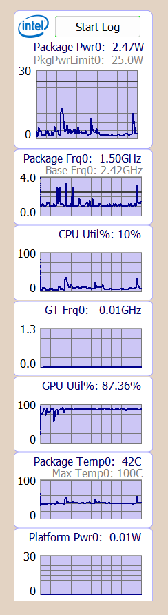
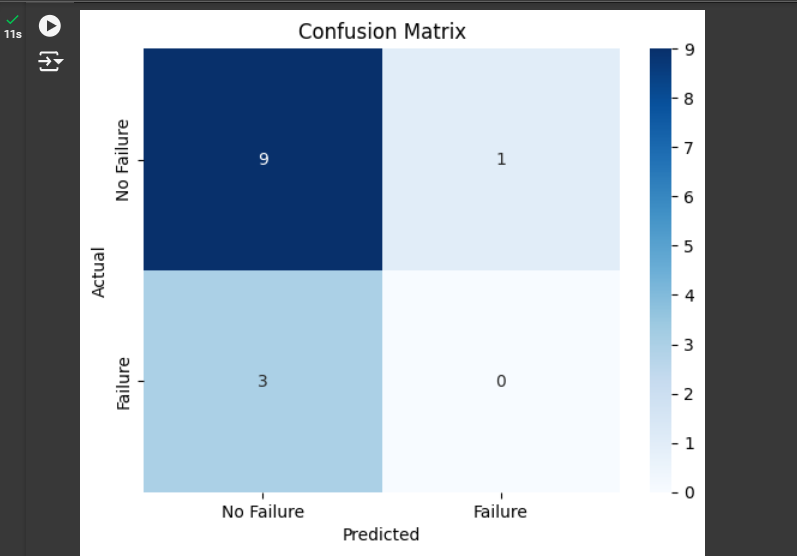
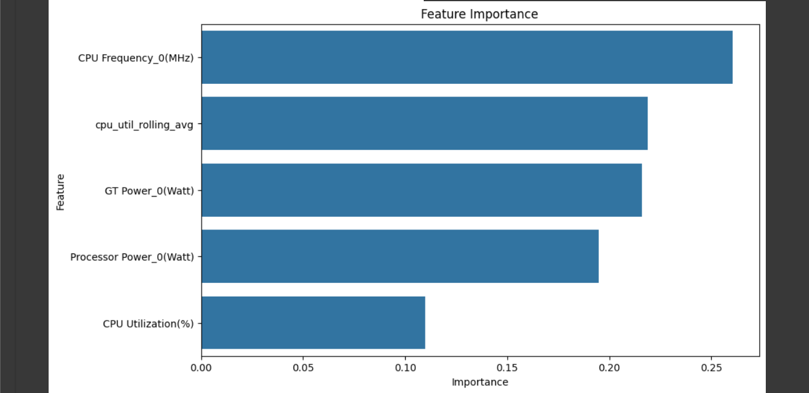

# Intel-Power-Manager-Telemetry
## Problem Statement
Machine Learning Algorithms for Predictive Maintenance in Power Manager Telemetry Systems.

The primary objective of this project is to optimize the power consumption of a laptop system by analyzing and predicting power usage patterns using machine learning algorithms. This involves collecting power consumption data, identifying inefficiencies, and implementing solutions to enhance overall energy efficiency.

## Idea Brief (Solution)
The proposed solution is to utilize machine learning algorithms to analyze power consumption data from various components of the laptop (CPU, GPU, memory, etc.). By predicting future power usage patterns and identifying inefficiencies, we can implement strategies to optimize power consumption, such as dynamically adjusting system settings and processes based on the predicted data.

## Features Offered:
- **Real-time Power Monitoring:** Collect and display real-time power consumption data.

- **Historical Data Analysis:** Store and analyze historical power consumption data to identify patterns.

- **Predictive Maintenance:** Predict future power consumption and identify potential issues before they occur.

- **Optimization Suggestions:** Provide actionable recommendations to optimize power usage.

- **Customizable Settings:** Allow users to set power-saving preferences based on their usage patterns.

## Process Flow
- **Data Collection:**
Use Intel Power Gadget and system monitoring tools to collect power consumption data.

- **Data Preprocessing:**
Clean and preprocess the collected data for analysis.

- **Data Analysis:**
Analyze historical power consumption data to identify patterns and inefficiencies.

- **Model Training:**
Train machine learning models to predict future power consumption based on historical data.

- **Prediction and Optimization:**
Use the trained models to predict future power usage and provide optimization suggestions.

- **Implementation:**
Implement the optimization strategies and continuously monitor their effectiveness.

## Technologies Used

**Intel Power Gadget:** A tool provided by Intel to measure and monitor power consumption and thermal data of Intel CPUs. It provides detailed power consumption metrics for various components of the CPU.

System Monitoring Tools: Additional tools and scripts (such as Python libraries like psutil) to collect system metrics like CPU load, memory usage, disk I/O, and network activity.
Data Preprocessing:

Pandas: A powerful Python library for data manipulation and analysis. Used for cleaning and preprocessing the collected data.
NumPy: A library for numerical operations in Python. Used for handling arrays and performing mathematical operations.
Data Storage:

CSV Files: Simple file format used to store the collected and processed data. Easy to read and write using Python libraries.
Data Analysis:

Matplotlib/Seaborn: Python libraries for data visualization. Used to create graphs and plots to visualize the power consumption data and identify patterns.
Scikit-Learn: A Python library for machine learning. Used for implementing and training machine learning models.
Machine Learning:

Random Forest: An ensemble learning method used for classification and regression. It helps in making more accurate predictions by combining multiple decision trees.

## Results

This chart displays the feature importance values for a machine learning model. Here's a breakdown of the chart:

## 1.Feature Importance:
The x-axis represents the importance of each feature, with higher values indicating greater importance.

## 2.Features:
The y-axis lists the features used in the model, which are:
- CPU Frequency_0(MHz)
- cpu_util_rolling_avg
- GT Power_0(Watt)
- Processor Power_0(Watt)
- CPU Utilization(%)

## Explanation of the Features:
- **CPU Frequency_0(MHz):** This represents the CPU frequency in MHz. It appears to be the most important feature in the model.

- **cpu_util_rolling_avg:** This is likely the rolling average of CPU utilization over a certain period. It is the second most important feature.

- **GT Power_0(Watt):** This is probably the power consumption of the graphics processing unit (GPU). It is the third most important feature.

- **Processor Power_0(Watt):** This represents the power consumption of the processor. It is the fourth most important feature.

- **CPU Utilization(%):** This is the percentage of CPU utilization. It is the least important feature among those listed.

## Insights:
- CPU Frequency_0(MHz) has the highest importance score, indicating it has the most significant impact on the model's predictions.

- cpu_util_rolling_avg, GT Power_0(Watt), and Processor Power_0(Watt) have similar importance scores, suggesting they are nearly equally influential in the model.

- CPU Utilization(%) has the lowest importance score, indicating it has the least impact on the model's predictions compared to the other features.

## Conclusion:
This project successfully demonstrates how machine learning algorithms can be leveraged to optimize power consumption in a laptop system. By collecting detailed power usage data and analyzing it using advanced machine learning techniques, we can predict future power consumption patterns and identify inefficiencies. The implemented solution not only provides real-time monitoring and historical data analysis but also offers actionable recommendations to enhance power efficiency. This approach can be extended to other systems and devices, contributing to overall energy savings and improved performance.
